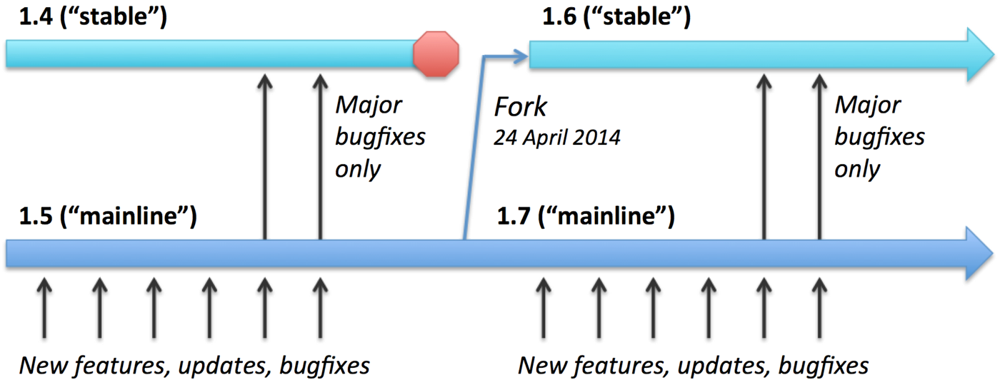

# NGINX_Reverse_Proxy

## Install NGINX from source (Debian)
 Install the prerequisites:

    apt install curl gnupg2 ca-certificates lsb-release debian-archive-keyring

 Import an official nginx signing key so apt could verify the packages authenticity. Fetch the key:

    curl https://nginx.org/keys/nginx_signing.key | gpg --dearmor \
        | tee /usr/share/keyrings/nginx-archive-keyring.gpg >/dev/null

 Verify that the downloaded file contains the proper key:

    gpg --dry-run --quiet --no-keyring --import --import-options import-show /usr/share/keyrings/nginx-archive-keyring.gpg

 The output should contain the full fingerprint 573BFD6B3D8FBC641079A6ABABF5BD827BD9BF62 as follows:

    pub   rsa2048 2011-08-19 [SC] [expires: 2024-06-14]
          573BFD6B3D8FBC641079A6ABABF5BD827BD9BF62
    uid                      nginx signing key <signing-key@nginx.com>
If the fingerprint is different, remove the file. 

 If you would like to use mainline nginx packages, run the following command instead:

    echo "deb [signed-by=/usr/share/keyrings/nginx-archive-keyring.gpg] \
    http://nginx.org/packages/mainline/debian `lsb_release -cs` nginx" \
        | tee /etc/apt/sources.list.d/nginx.list

 Set up repository pinning to prefer our packages over distribution-provided ones:

    echo -e "Package: *\nPin: origin nginx.org\nPin: release o=nginx\nPin-Priority: 900\n" \
        | tee /etc/apt/preferences.d/99nginx

 To install nginx, run the following commands:

    apt update
    apt install nginx

## Helpful Commands
### Verifying config
Check conf file

    nginx -t

Load new confs

    nginx -s reload

## Install Let's Encrypt Certs
Install certbot

    apt install certbot python3-certbot-nginx

Get lets Cert

    certbot --nginx -d example.com www.example.com
Wild Card Cert

    certbot certonly   --agree-tos   --email letsencrypt@example.com   --manual   --preferred-challenges=dns   -d example.com    -d *.example.com   --server https://acme-v02.api.letsencrypt.org/directory

https://toolbox.googleapps.com/apps/dig/#TXT/_acme-challenge.example.com